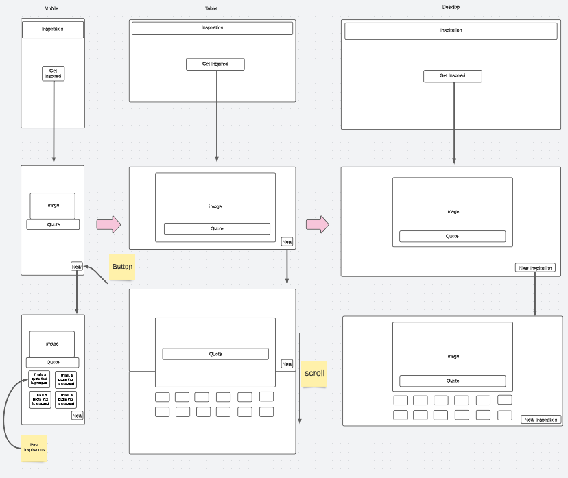

# Ron Swanson Inspires | An inspirational quote generator

### Live link to deployed app
[Project1](https://alecdziwanowski.github.io/Project1/)

### List of technologies
[Bootstraps](https://cdn.jsdelivr.net/npm/bootstrap@4.6.1/dist/css/bootstrap.min.css)

## Description
A simple web application designed to pull random photos and pair it with an inspirational quote. Both image and quote are randomly generated from separate APIs. User will be prompted initially with a blank screen populated by a start button. Once start button is clicked, page will be filled with picture, text content, and next button. When user clicks next button, the function will run again and retrieve another picture and quote. All previous quotes and pictures will be stored in local storage and placed beneath the currently displayed image and quote.

## APIs
### Quotes: [Ron Swanson's Quote](https://ron-swanson-quotes.herokuapp.com/v2/quotes)  
### Images: [Random Cat Images](https://api.thecatapi.com/v1/images/search)

## Screenshot of Wireframe

